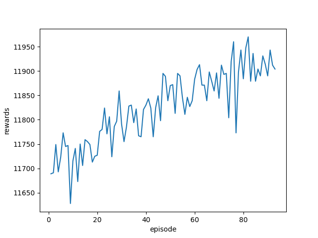
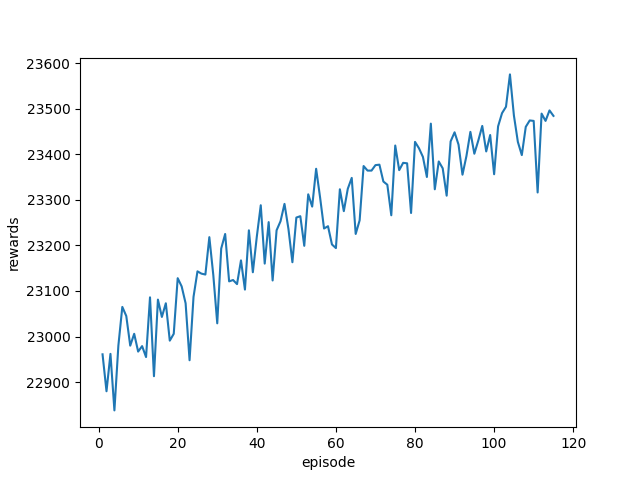
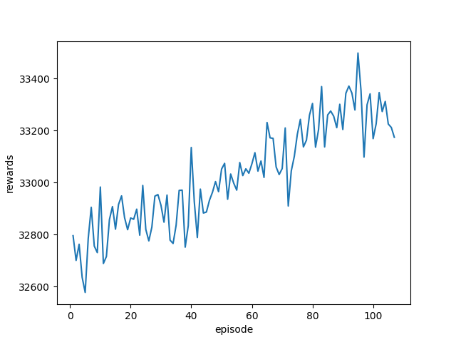
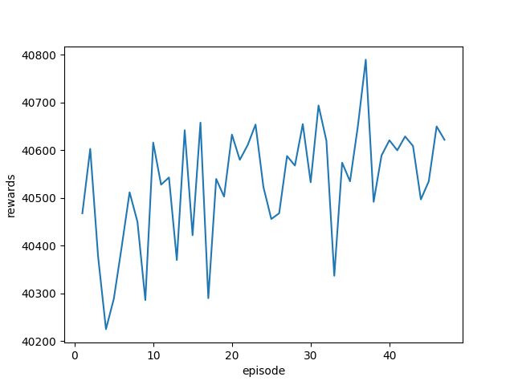

# ***Resource Allocation in Edge Computing Using Reinforcement Learning***

## Summary
In recent years, cloud-based smartphone applications like augmented reality (AR), facial recognition, and object detection have gained popularity. Because of the distant execution, cloud computing may create significant latency and increasing backhaul bandwidth use. Edge computing, which moves storage and processing resources closer to mobile consumers, can increase reaction times and reduce backhaul congestion, addressing these issues.

This project seeks to employ Deep Deterministic Policy Gradient (DDPG), a type of Reinforcement Learning (RL) technique, to distribute resources for mobile users in an edge computing environment, taking into account computational resources, migration bandwidth, and offloading targets.

***

## Prerequisite

+ Python 3.7.5 or latest
+ Tensorflow 2.2.0 or latest
+ Tkinter 8.6 or latest

***

## Build Setup

### *Run The System*

```cmd
$ python3 src/run_this.py
```


### *Graphic Interface Eable / Disable* (in run_this.py)

```python
SCREEN_RENDER = True / False
```

***

## Key Point

## *Edge Computing Environment*

+ Mobile User
  + Users move according to the mobility data provided by [CRAWDAD](https://crawdad.org/index.html). This data was collected from the users of mobile devices at the subway station in Seoul, Korea.
  + Users' devices offload tasks to one edge server to obtain computation service.
  + After a request task has been processed, users need to receive the processed task from the edge server and offload a new task to an edge server again.

+ Edge Server
  + Responsible for offering computational resources and processing tasks for mobile users.
  + Each edge server can only provide service to limited numbers of users and allocate computational resources to them.
  + The task may be migrated from one edge server to another within limited bandwidth.

+ Request Task: [VOC SSD300 Objection Detection](https://link.springer.com/chapter/10.1007/978-3-319-46448-0_2)
  + state 1 : start to offload a task to the edge server
  + state 2 : request task is on the way to the edge server.
  + state 3 : request task is proccessed.
  + state 4 : request task is on the way back to the mobile user.
  + state 5 : disconnect (default)
  + state 6 : request task is migrated to another edge server

+ Graphic Interface

  
  + Edge servers *(static)*
    + Big dots with consistent color
  + Mobile users *(dynamic)*
    + Small dots with changing color
    + Color
      + Red : request task is in state 5
      + Green : request task is in state 6
      + others : request task is handled by the edge server with the same color and is in state 1 ~ state 4

## *Deep Deterministic Policy Gradient* (in DDPG.py)

+ Description
  
  Allocating computer resources and migration bandwidth are continuous variable problems, whereas selecting the offloading server for each user is a discrete variable challenge. As a result, the model-free off-policy actor-critic method Deep Deterministic Policy Gradient (DDPG) can tackle both discrete and continuous problems. DDPG also changes model weights at every step, allowing the model to immediately adapt to a changing environment.

+ State

  ```python
    def generate_state(two_table, U, E, x_min, y_min):
        one_table = two_to_one(two_table)
        S = np.zeros((len(E) + one_table.size + len(U) + len(U)*2))
        count = 0
        for edge in E:
            S[count] = edge.capability/(r_bound*10)
            count += 1
        for i in range(len(one_table)):
            S[count] = one_table[i]/(b_bound*10)
            count += 1
        for user in U:
            S[count] = user.req.edge_id/100
            count += 1
        for user in U:
            S[count] = (user.loc[0][0] + abs(x_min))/1e5
            S[count+1] = (user.loc[0][1] + abs(y_min))/1e5
            count += 2
        return S
  ```

  + **Available computing resources** of each edge server
  + **Available migration bandwidth** of each connection between edge servers
  + **Offloading target** of each mobile user
  + **Location** of each mobile user

+ Action

  ```python
  def generate_action(R, B, O):
    a = np.zeros(USER_NUM + USER_NUM + EDGE_NUM * USER_NUM)
    a[:USER_NUM] = R / r_bound
    # bandwidth
    a[USER_NUM:USER_NUM + USER_NUM] = B / b_bound
    # offload
    base = USER_NUM + USER_NUM
    for user_id in range(USER_NUM):
        a[base + int(O[user_id])] = 1
        base += EDGE_NUM
    return a
  ```

  + **Computing resources**  of each mobile user's task need to uses(continuous)
  + **Migration bandwidth** of each mobile user's task needs to occupy (continuous)
  + **Offloading target** of each mobile user (discrete)

+ Reward
  + **Total processed tasks** in each step

***

## Simulation Result

+ Simulation Environment
  + 10 edge servers with computational resources.
  + Each edge server can provide at most 4 task processing services.
  + 3000 steps/episode, 90000 sec/episode.

+ Result
    | Number of Clients | Average Total proccessed tasks in the last 10 episodes| Training History |
    | :-------: | :--------: | :--------: |
    | 10 | 11910 |  |
    | 20 | 23449 |  |
    | 30 | 33257 |  |
    | 40 | 40584 |  |

***

## Demo

+ Demo Environment

  + 35 mobile users and 10 edge servers in the environment
  + Each edge server can provide at most 4 task processing services.

+ Demo Video

  

***

## Reference

+ Mobility Data
  
  [Mongnam Han, Youngseok Lee, Sue B. Moon, Keon Jang, Dooyoung Lee, CRAWDAD dataset kaist/wibro (v. 2008‑06‑04), downloaded from https://crawdad.org/kaist/wibro/20080604, https://doi.org/10.15783/C72S3B, Jun 2008.](https://crawdad.org/kaist/wibro/20080604)
